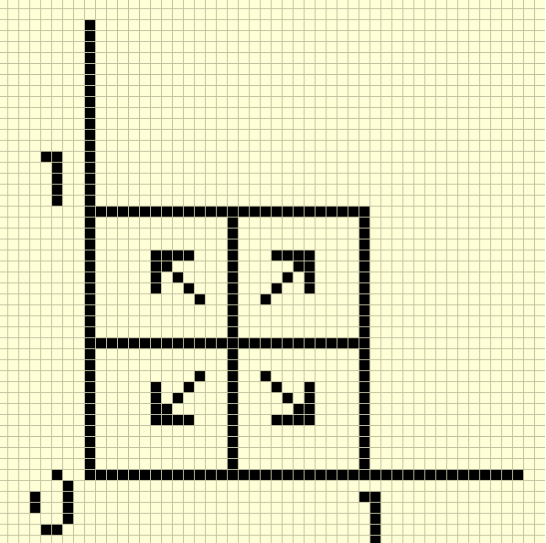
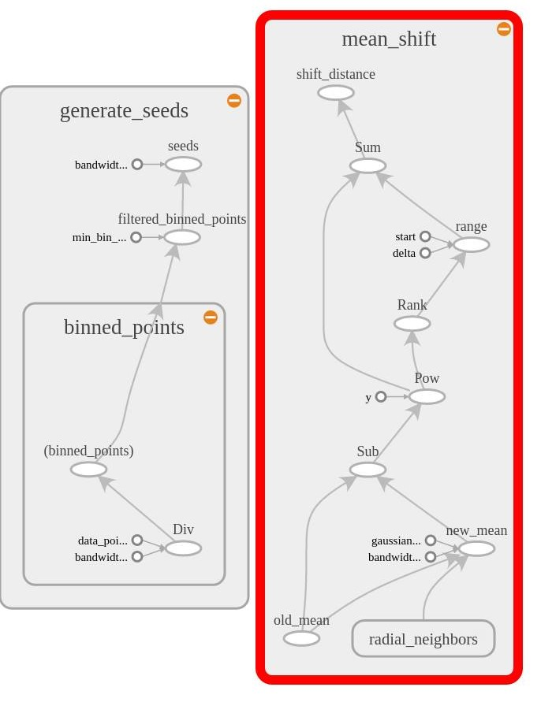

# Mean Shift Image Segmentation

#### An Implementation using the TensorFlow Framework

## Overview
 Image segmentation provides us with an easier way to analyse an image by clustering similar parts of image together so the they may be analysed as a single unit. The result is a set of segments or contours which significantly differentiate different areas of the image. We will be implementing the Mean Shift Image Segmentation Method.

 Mean Shift Clustering is a non-parametric kernel density estimation technique, that clusters points based on repeatedly updating the mean. The means will dictate how the image will be segmented and the number of such segments.  

 The algorithm for this method in general involves the following steps.
 +  Apply a kernel on a data point over neighbours within a sufficient bandwidth distance, with the chosen point as the mean of the kernel distribution.
 +  Compute a new mean after applying the kernel
 +  Repeat till convergence.
 +  Join nearest means
 +  Assign a label to every pixel equivalent to label of nearest mean  

There exists a rigorous proof for convergence of the mean by this method, we will not be covering it here. But this procedure as it is , is very heavy computationally. So we employ different methods to speed up the segmentation process. We have used Tensorflow , an open source software library for numerical computation using data flow graphs, which has very efficient implementations of matrix computations.

## Optimizations

We have also tweaked the algorithm with various heuristics to bring down the complexity

#### Binned Estimator

Traditionally we are to apply the kernel on every point and find the convergence point. Although it is very accurate to do so, we will not be doing it on every point. Instead we’ll be choosing some initial seeds, which will represent the neighbourhood! And will approximately converge to final means. The seeds are chosen the following way

 +  Divide all the coordinates of all the pixels of the image by the bandwidth.  
 +  Round off the coordinates to the nearest whole number.
 +  Create bins indexed as whole numbers.
 +  Compute frequency of each bin
 +  Ignore all bins below a threshold frequency
 +  The whole number points, multiplied by bandwidth, will be  the seeds.

 The Mean Shift procedure will be initialised only at these points.  The motivation behind this binning can be visualised here 

Every point in the grid will also converge to same point as the nearest whole number point will converge (approximately!)

#### Radial Nearest Neighbours
To apply on the points within a distance of bandwidth ( &delta; ), we need to find all the points that are closer than a distance of &delta;.

Note: Distance is computed in 5 dimensional hyperspace of the image.

##### A trick

We search for neighbours in a brute
force way but by choosing only a small area! Choose those pixels only whose distance geometrically is than &delta; So anything beyond these points is atleast as far as &delta; So any point whose distance D is than &delta; in the 5D space will definitely lie here!.

### Tensorflow Network

The above algorithm involves matrix computations, which are efficiently implemented in Tensorflow.  

All computations are done using data flow graphs. Nodes in the  graph represent mathematical operations, while the graph edges  represent the multidimensional data arrays (tensors) communicated  between them

This is the data flow graph generated  by our method.

Every node is some function we’ve written. Seeds are  generated by the first graph and on every seed, the second method is  applied to find converging means. Note the subgraphs for generating radial nearest neighbours and binned points.

By doing so we can easily between GPU and CPU as it is  already internalised in Tensorflow.

Please find results in the  
<a href="https://github.com/manikantareddyd/TF_Mean_Shift_Image_Clustering/blob/master/Mean%20Shift%20Image%20Segmentation.pdf/">report</a>
